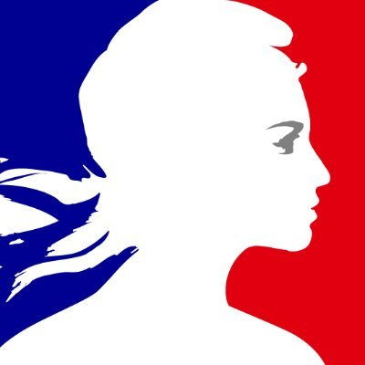
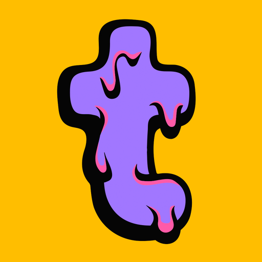

# KeepForEver - Open Source Logo Integration

## Welcome to KeepForEver Repository 🚀

This open-source project invites companies to seamlessly integrate their logos into the KeepForEver platform. By contributing your logo, you enhance the visual appeal and personalization of the digital legacy experience.

## How to contribute

1. **Fork the Repository 🍴** Start by forking this repository to your account.
2. **Add Your Logo 🖼️** Locate the `services/logo` directory and upload your company logo using the recommended format (PNG, JPG, SVG, or WebP). Ensure the filename is lowercase and corresponds to your company name.
3. **Update services.json 📝** Run the `main.py` script to automatically update the index. This includes your logo in the KeepForEver [services.json](https://github.com/MyKeepForEver/add-your-logo/blob/main/services.json).
4. **Submit a Pull Request 🚢** Once you've added your logo, submit a pull request. We'll promptly review it, and upon approval, your logo becomes part of the KeepForEver logo collection.

## services.json Structure

```json
{
  "s": {
    "service1": {
      "p": "svg"
    },
    "service2": {
      "p": "png"
    },
    "service3": {
      "p": "webp"
    },
    "service4": {
      "p": "jpg"
    }
}
```

## Important Notes

- Ensure your logo adheres to our quality and size guidelines.
- We appreciate your contribution to the KeepForEver community! 🌐

Thank you for being part of the KeepForEver legacy! If you have questions or need assistance, feel free to reach out.

---


## Services already integrated

| Service 1 | Service 2 | Service 3 | Service 4 | Service 5 |
| --- | --- | --- | --- | --- |
|  |  |  |  |  |
|  |  |  |  |  |
|  |  |  |  |  |
|  |  |  |  |  |
|  |  |  |  |  |
|  |  |  |  |  |
|  |  |  |  |  |
|  |  |  |  |  |
|  |  |  |  |  |
|  |
